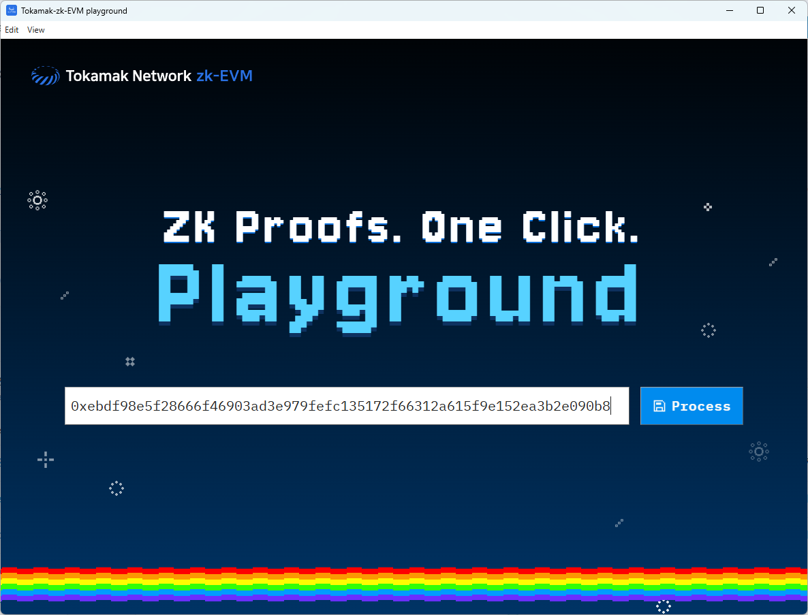

# Tokamak-zk-evm-playground User Guide

Hello! This document guides you on how to install and run **Tokamak-zk-evm-playground** on your computer. It might seem a bit unfamiliar, but if you follow the steps carefully, it won't be difficult! 😊

## 1. What is this program?

- Tokamak-zk-evm-playground is a program that helps you understand and experience the overall flow of Tokamak zk-EVM easily and enjoyably without requiring difficult technical knowledge.
- It's like looking inside and tinkering with a complex machine, allowing you to simulate the key processes of Tokamak zk-EVM step by step.

## 2. Before you start: You need "Docker"! 🐳

- **What is Docker?**
  - Docker is like a magic box that helps our program (Tokamak-zk-EVM) run smoothly on any computer without complex settings. Thanks to this box, you can have all the necessary preparations at once, greatly reducing the "It doesn't work on my computer" problem.
- **Why is it needed?**
  - Tokamak-zk-EVM requires various development tools and a special execution environment. Docker neatly packages all of this, allowing you to focus on using the program instead of going through a complex installation process.

## 3. Installation Process (Step-by-Step Guide) 🛠️

### 3.1. Installing Docker

- **Requirements:**
  - A stable internet connection
  - Check the operating system of your computer (e.g., Windows 10/11, latest macOS version, etc.)
- **Installation Method:**

  1. **Access the Docker download page:**
     - **Windows users:** [Download Docker Desktop for Windows](https://www.docker.com/products/docker-desktop/) (Click to go to the download page)
     - **Mac users (Check Intel chip / Apple Silicon chip before downloading):** [Download Docker Desktop for Mac](https://www.docker.com/products/docker-desktop/) (Click to go to the download page)
  2. **Proceed with download and installation:**
     - Run the downloaded installation file (`Docker Desktop Installer.exe` or `Docker.dmg`) and follow the on-screen instructions to complete the installation.
     - (For Windows, you may need to install or configure WSL 2. Follow the on-screen instructions carefully.)
     - (If there are any special options to select, specify them here. Most of the time, keeping the default settings is fine.)
  3. **Verify installation (Most important! ✨):**

     - You may need to reboot your computer after installation.
     - Launch **Docker Desktop** from the desktop or application list.
     - Check if the **whale icon** 🐳 appears in the taskbar (Windows) or dock menu (Mac).
       
     - If you see the message "Docker Desktop is running" (or a green "Running" indicator) when you click the whale icon, or if the Docker program window opens, it means it has been successfully executed!

       

       

       - If it doesn't run or you see an error message, try rebooting your computer and running Docker Desktop again.

### 3.2. Downloading and Preparing Tokamak-zk-evm-playground

- **Download:**
  - [Download the latest version](https://github.com/tokamak-network/Tokamak-zk-EVM-playgrounds/releases/tag/0.0.1-alpha)
  - The download file is in a compressed `.zip` format.
  - **Mac users (Apple Silicon):** Download the arm-64 version. (e.g., `playground-hub-macOS-arm64-v0.0.1-portable.zip`)
  - **Windows users:** Download the Windows version.
- **Extract:**
  - Extract the downloaded compressed file to a convenient folder. (e.g., Right-click and "Extract..." on Windows, double-click on Mac)
- **File Location:**
  - Place the extracted `Tokamak-zk-evm-playground` folder in an easily accessible location. (e.g., `Desktop`, `Documents`, or `Downloads` folder)

## 4. Running Tokamak-zk-evm-playground 🚀

1. **(Most important!) First, make sure Docker Desktop is running.** (The whale icon 🐳 should be visible and in "running" status!)

- If Docker is not installed or running, a warning message will appear, and you cannot proceed to the next step.

2. Navigate to the folder where you previously extracted `Tokamak-zk-evm-playground`.
3. Find and double-click the following executable file inside the folder:
   - **Windows:** `(Executable file name.exe)` (e.g., `tokamak-zk-evm-playground.exe`)
   - **macOS:** `(Executable file name.app)` (e.g., `tokamak-zk-evm-playground.app`)
4. Wait a moment for the program to start.

## 5. How to Use the Program (Brief Introduction) 📖

1. If the program runs successfully, you will see a screen like this.
   
2. Click the cloud located under the **EVM Spec.** heading in the top left corner to display a modal screen like this.  
   
3. This modal allows you to select one of the various Tokamak-zk-EVM specs supported by the current Tokamak-zk-evm-playground. Click the download button located to the right of the title to start downloading the Docker image for the selected Tokamak-zk-EVM spec.
   
4. Once the download is complete, the download button icon changes to a check icon, indicating that the Tokamak-zk-EVM image for the selected spec is ready for use. Clicking the Tokamak-zk-EVM text will proceed to the next step.  
   
5. After clicking, the modal automatically closes, and an animation begins to fill the pipeline starting from the cloud towards the next step. The animation ends when it reaches the handle part of the next step, and the color of the previously inactive **frontend/qap-compiler** heading is activated, indicating that the step is ready to be executed.
   
6. Let's set up the EVM Transaction in the same flow. Click the cloud located under the **Ethereum transaction** heading to display a modal where you can input a transaction hash.
   
7. Go to the [Etherscan page](https://etherscan.io/).
   
8. Find a transaction you want to verify through the Tokamak-zk-EVM and copy its hash value using the copy button next to the Transaction Hash.
   

9. When you find a transaction you want to verify through Tokamak-zk-EVM, use the copy button located to the right of the Transaction Hash to copy the hash value of the transaction.
   
   9-1. If the copied hash value is incorrect, an error like this will appear, and the Input button will not be activated. For any other issues, the button will also remain inactive, and a message corresponding to the problem will be displayed in the same area.  
    
10. Paste the copied hash value into the input area of the modal, and if the transaction hash can be proven by the current Tokamak-zk-EVM, the Input button will be activated as follows.
    
    10-1. If the copied hash value is incorrect, an error like this will appear, and the Input button will not be activated. In other cases of issues, the button will not be activated, and a message corresponding to each issue will be displayed in the same area.  
    
11. When the Input button is activated, click the button to close the modal, and an animation similar to before will start. Since frontend/synthesizer requires both the Ethereum transaction just activated and the operation of frontend/qap-compiler, it appears inactive. To activate frontend/synthesizer, first click the handle part of the activated frontend/qap-compiler to execute it.
    
12. Once frontend/qap-compiler execution is complete, you will see that **frontend/synthesizer** and **backend/setup** are both activated. You can execute any of the activated handles in any order. In this document, we will execute frontend/synthesizer first.
    
13. After frontend/synthesizer execution is complete, you will see that **libs/internal/bikzg** is activated. Before executing this part, let's proceed with backend/setup first. Again, you can execute activated handles in any order, so if you want to execute libs/internal/bikzg first, feel free to do so.
    
14. Once backend/setup is complete, **backend/prove** is activated. The actual setup process takes a considerable amount of time, but since the setup is already completed through the Docker image downloaded earlier, it takes almost no time within the playground, and you can see it quickly executed.
    
15. Once backend/setup is complete, you can see that both packages for executing the final action, Verify, are ready. First, execute libs/internal/bikzg.
    
16. Then, execute backend/prove, and you will see that **backend/verify** is activated. By operating prove, you can check the final result of how the Ethereum transaction we selected earlier is analyzed through Tokamak-zk-EVM.
    
17. Once backend/prove operation is complete, the water tank changes according to the evidence created earlier and the verification result. If the evidence was created correctly and the verification was successful, the tank will be filled with blue water along with the number **1**, indicating True. This means that Tokamak-zk-EVM operated correctly.
    
    17-1. If it did not operate correctly or there was an issue, the tank will be filled with white along with the number 0, indicating False. In such cases, there may be a problem with Tokamak-zk-EVM, so please report it using section 6 below!

## 6. Having Trouble? (Simple Troubleshooting) 🤔

- **"Docker is not running" message appears / The program cannot find Docker.**

  - First, make sure Docker Desktop is really running (whale icon 🐳!).
  - Try completely closing Docker Desktop and running it again.
  - Reboot your computer, run Docker Desktop first, and then run Tokamak-zk-evm-playground.

- **If you need more help, leave an issue on the [GitHub Issues page](https://github.com/tokamak-network/Tokamak-zk-EVM-playgrounds/issues):**

## 7. Uninstalling the Program 🗑️

- **Uninstalling Tokamak-zk-evm-playground:**
  - Exit the `Tokamak-zk-evm-playground` program.
  - Delete the entire folder where the program is installed (or extracted) or just the executable file. (No separate uninstaller is needed!)
- **Uninstalling Docker (if you no longer use Tokamak-zk-evm-playground or other Docker-based programs):**
  - **Windows:** Go to `Settings` > `Apps` > `Installed Apps` list, find `Docker Desktop`, and remove it.
  - **Mac:** Drag `Docker.app` from the `Applications` folder to the trash.
  - (Be cautious when deleting Docker, as you won't be able to use other Docker-based programs!)
  - (For more details, refer to the uninstallation guide on the official Docker website.)
