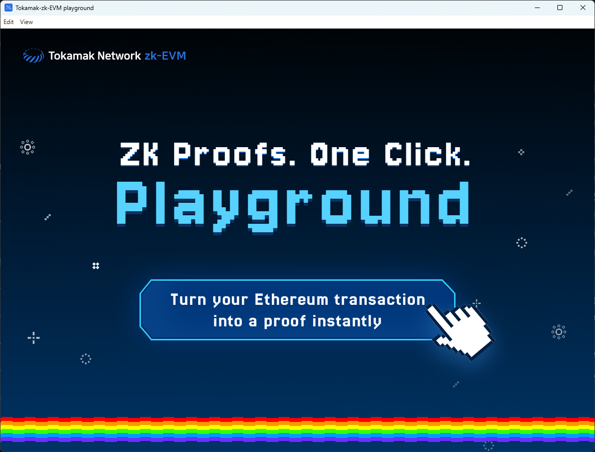
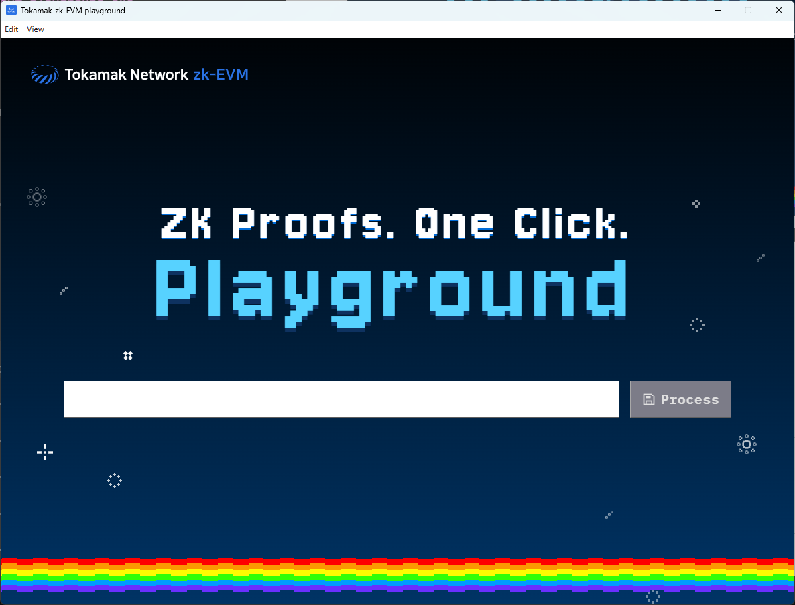

# Tokamak-zk-evm-playground 사용 안내서

안녕하세요! 이 문서는 **Tokamak-zk-evm-playground**를 여러분의 컴퓨터에 설치하고 실행하는 방법을 안내해 드립니다. 조금 생소한 과정이 있을 수 있지만, 차근차근 따라 하시면 어렵지 않아요! 😊

## 1. 이 프로그램은 무엇인가요?

- Tokamak-zk-evm-playground는 어려운 전문 지식 없이도 Tokamak zk-EVM이 어떻게 작동하는지 그 전체적인 흐름을 쉽고 재미있게 이해하고 체험해 볼 수 있도록 도와주는 프로그램입니다.
- 마치 복잡한 기계의 내부를 직접 들여다보고 만져보는 것처럼, Tokamak zk-EVM의 주요 과정을 단계별로 시뮬레이션해볼 수 있습니다.

## 2. 시작하기 전에: "도커(Docker)"가 필요해요! 🐳

- **도커가 뭔가요?**
  - 도커는 우리 프로그램(Tokamak-zk-EVM)이 어떤 컴퓨터에서든 복잡한 설정 없이 똑같이 잘 돌아갈 수 있도록 도와주는 마법 상자 같은 거예요. 이 상자 덕분에 필요한 모든 준비물을 한 번에 갖추고, "내 컴퓨터에서는 안 되는데?" 하는 문제를 크게 줄일 수 있답니다.
- **왜 필요한가요?**
  - Tokamak-zk-EVM은 여러 가지 개발 도구와 특별한 실행 환경을 필요로 해요. 도커는 이 모든 것을 깔끔하게 담아서 제공하기 때문에, 여러분은 복잡한 설치 과정 대신 프로그램 사용에만 집중할 수 있습니다.

## 3. 설치 과정 (단계별 안내) 🛠️

### 3.1. 도커(Docker) 설치하기

- **준비물:**
  - 안정적인 인터넷 연결
  - 사용 중인 컴퓨터 운영체제 확인 (예: Windows 10/11, macOS 최신 버전 등 지원하는 OS 명시)
- **설치 방법:**

  1.  **도커 다운로드 페이지 접속:**
      - **Windows 사용자:** [Docker Desktop for Windows 다운로드](https://www.docker.com/products/docker-desktop/) (클릭하시면 다운로드 페이지로 이동합니다)
      - **Mac 사용자 (Intel칩 / Apple Silicon칩 확인 후 다운로드):** [Docker Desktop for Mac 다운로드](https://www.docker.com/products/docker-desktop/) (클릭하시면 다운로드 페이지로 이동합니다)
  2.  **다운로드 및 설치 진행:**
      - 다운로드된 설치 파일(`Docker Desktop Installer.exe` 또는 `Docker.dmg`)을 실행하고, 화면에 나오는 안내에 따라 설치를 진행해주세요.
      - (Windows의 경우, WSL 2 관련 설치나 설정이 필요할 수 있습니다. 화면 안내를 잘 따라주세요.)
      - (특별히 선택해야 하는 옵션이 있다면 여기에 명시. 대부분 기본 설정을 유지하면 됩니다.)
  3.  **설치 확인 (가장 중요! ✨):**

      - 설치가 완료되면 컴퓨터를 재부팅해야 할 수 있습니다.
      - 바탕화면이나 응용 프로그램 목록에서 **Docker Desktop**을 실행해주세요.
      - 컴퓨터 화면 오른쪽 아래 작업 표시줄(Windows)이나 화면 독 메뉴(Mac)에 **고래 모양 아이콘**🐳이 나타나는지 확인해주세요.
        
      - 고래 아이콘을 클릭했을 때 "Docker Desktop is running" (또는 초록색으로 "Running" 표시) 메시지가 보이거나 도커 프로그램 창이 열린다면 성공적으로 실행된 것입니다!

        

        

        - 만약 실행되지 않거나 오류 메시지가 보인다면, 컴퓨터를 다시 한번 재부팅하고 Docker Desktop을 실행해보세요.

### 3.2. Tokamak-zk-evm-playground 다운로드 및 준비하기

- **다운로드:**
  - [최신 버전 다운로드](https://github.com/tokamak-network/Tokamak-zk-EVM-playgrounds/releases/tag/0.0.1-alpha)
  - 다운로드 파일은 압축 파일(`.zip`) 형태입니다.
  - **Mac 사용자 (Apple Silicon):** arm-64 버전을 다운로드하세요. (예: `playground-hub-macOS-arm64-v0.0.1-portable.zip`)
  - **Windows 사용자:** Windows 버전을 다운로드하세요.
- **압축 해제:**
  - 다운로드한 압축 파일을 사용하기 편한 폴더에 풀어주세요. (예: Windows에서는 마우스 오른쪽 클릭 후 "압축 풀기...", Mac에서는 더블 클릭)
- **파일 위치:**
  - 압축을 푼 `Tokamak-zk-evm-playground` 폴더를 사용자가 찾기 쉬운 곳에 두세요. (예: `바탕화면`, `내 문서` 또는 `다운로드` 폴더 등)

## 4. Tokamak-zk-evm-playground 실행하기 🚀

1.  **(가장 중요!) 먼저 Docker Desktop이 실행 중인지 다시 한번 확인해주세요.** (화면에 고래 아이콘🐳이 보이고 "running" 상태여야 합니다!)

- 도커가 설치돼있지않거나 실행하지 않고 Tokamak-zk-evm-playground를 실행한다면 도커를 설치하거나 실행하라고 경고 메세지가 나타나며 다음 단계로 진행되지 않습니다.

2.  이전에 `Tokamak-zk-evm-playground` 압축을 푼 폴더로 이동합니다.
3.  폴더 안에서 다음 실행 파일을 찾아 더블 클릭하여 실행합니다:
    - **Windows:** `(실행 파일 이름.exe)` (예: `tokamak-zk-evm-playground.exe`)
    - **macOS:** `(실행 파일 이름.app)` (예: `tokamak-zk-evm-playground.app`)
4.  프로그램이 시작되면 잠시 기다려주세요.

## 5. 프로그램 사용 방법 (간단 소개) 📖

1. 프로그램이 정상적으로 실행되었다면 다음과 같은 화면이 보일 것입니다.
   
2. 왼쪽 상단의 **EVM Spec.** 말머리 아래에 위치한 구름을 클릭하면 아래와 같은 모달 화면이 나타납니다.  
   
3. 이 모달에서는 현재 Tokamak-zk-EVM-playground가 지원하고 있는 여러 스펙의 Tokamak-zk-EVM 중 하나를 선택할 수 있게 합니다. 타이틀 오른쪽에 위치하고 있는 다운로드 버튼을 클릭하면 해당하는 스펙의 Tokamak-zk-EVM 도커 이미지의 다운로드를 시작합니다.
   
4. 다운로드가 완료되면 다운로드 버튼 아이콘이 체크 아이콘으로 바뀌며 해당 스펙의 Tokamak-zk-EVM 이미지 사용 준비가 완료되었음을 나타냅니다. 이 상태에서 Tokamak-zk-EVM 텍스트를 클릭하게 되면 다음 단계로 진행이 됩니다.  
   
5. 클릭 이후 모달이 자동으로 닫히며 구름에서 시작된 파이프라인을 채우는 애니메이션이 다음 단계를 향하기 시작합니다. 해당 애니메이션은 다음 스텝에 해당하는 핸들 부분에 도착하면 종료가 되며, 비활성화돼있던 **frontend/qap-compiler** 말머리 컬러가 활성화되며 해당 스텝이 실행 준비가 됐음을 나타냅니다.
   
6. 같은 흐름으로 EVM Transaction을 세팅해보도록 하겠습니다. EVM Spec과 마찬가지로 **Ethereum transaction** 말머리 아래에 위치한 구름을 클릭하면 다음과 같은 모달이 나타납니다. 해당 모달의 입력 영역에는 앞 서 선택한 EVM Spec이 지원하는 성격의 이더리움 트랜잭션 해쉬값을 넣어주어야 합니다.[이더스캔 페이지](https://etherscan.io/)로 접속을 합니다.
   
7. Tokamak-zk-EVM을 통해 확인하고 싶은 트랜잭션을 발견하면 Transaction Hash 오른쪽에 위치한 복사 버튼을 통해 해당 트랜잭션의 해쉬 값을 복사합니다.
   
8. 복사한 해쉬 값을 모달의 입력 영역에 붙여넣기하고 해당 트랜잭션 해쉬가 현재 Tokamak-zk-EVM으로 증명할 수 있는 트랜잭션이면 다음과 같이 Input 버튼이 활성화가 됩니다.
   
   8-1. 혹시 복사한 해쉬값이 올바르지 않으면 다음과 같은 에러가 나타나며 Input 버튼이 활성화되지 않습니다. 기타 다른 문제들의 경우에도 버튼이 활성화되지않으며 각 문제에 해당하는 메세지가 동일한 영역에 노출되게 됩니다.  
   
9. Input 버튼이 활성화된 상태에서 버튼을 클릭하면 모달이 닫히며 이전과 같은 형태의 애니메이션이 시작됩니다. 애니메이션이 완료되면 frontend/qap-compiler와 frontend/synthesizer의 핸들들이 모두 활성화된 것을 보실 수 있습니다. 활성화 된 핸들은 어떤 것을 먼저 실행해도 무방합니다. 이 문서에서는 qap-compiler를 먼저 실행해보도록 하겠습니다.
   
10. frontend/qap-compiler의 실행이 완료되면 **frontend/synthesizer**와 **backend/setup**이 모두 활성화된 것을 보실 수 있습니다. 이어서 frontend/synthesizer를 먼저 실행해보겠습니다. (실행에 다소 시간이 걸리는 프로세스들의 경우, 아래와 같은 로딩 모달이 나타나며 해당 프로세스 처리가 모두 완료될 경우 자동으로 모달이 닫히며 애니메이션 재생이 계속 됩니다.)
    
    
11. frontend/synthesizer의 실행이 끝나면 그 이후 단계들은 **backend/setup**이 함께 이루어져야 함을 파이프라인들을 통해 유추할 수 있습니다. 현재 유일하게 활성화 된 backend/setup 쪽을 먼저 진행하도록 하겠습니다.
    
12. backend/setup이 완료되면 **backend/prove**가 활성화됩니다. 실제로 이 setup에 해당하는 프로세스는 상당한 시간이 소요되나, 앞에서 다운로드 받은 도커 이미지를 통해 해당 셋업이 모두 이루어져 있는 상태입니다. 그렇기에 플레이그라운드 내에서는 시간이 거의 소요되지 않으며 빠르게 실행이 완료되는 모습을 확인하실 수 있습니다.
    
13. backend/setup이 완료되면 최종 액션인 Verify 실행을 위한 두 가지 패키지 모두 실행 준비 되었음을 확인할 수 있습니다. 먼저 backend/preprocess를 실행합니다.
    
    
14. 이어서 backend/prove를 실행하면 다음과 같이 **backend/verify**가 활성화됩니다. verify를 작동시키면 앞에서 저희가 선택한 이더리움의 트랜잭션이 Tokamak-zk-EVM을 통해 어떻게 분석이 되는지 최종 결과를 확인할 수 있습니다.
    
    
15. backend/prove의 작동이 끝나면 이전에 생성한 증거와 이를 검증한 결과에 따라 물탱크가 변하게 됩니다. 앞에서 증거를 올바로 생성했고 검증이 제대로 이루어지면 True를 의미하는 **1**이라는 숫자와 함께 파란색의 물로 물탱크가 채워집니다. 이는 Tokamak-zk-EVM이 올바로 작동했음을 나타냅니다.
    
    15-1. 혹시나 올바르게 작동하지 않았거나 문제가 생겼을 경우 False를 의미하는 0과 함께 하얀색으로 탱크가 채워질 것입니다. 해당하는 경우에는 Tokamak-zk-EVM에 문제가 있을 수 있으므로, 아래 6번 섹션을 활용해 제보를 부탁드립니다!
    

## 6. 문제가 생겼나요? (간단한 문제 해결) 🤔

- **"도커가 실행되고 있지 않아요." 라는 메시지가 떠요 / 프로그램이 도커를 찾지 못해요.**

  - 가장 먼저 Docker Desktop이 정말 실행 중인지 확인해주세요 (고래 아이콘🐳!).
  - Docker Desktop을 완전히 종료했다가 다시 실행해보세요.
  - 컴퓨터를 재부팅한 후 Docker Desktop을 먼저 실행하고, 그다음에 Tokamak-zk-evm-playground를 실행해보세요.

- **더 많은 도움이 필요하면 [GitHub Issues 페이지](https://github.com/tokamak-network/Tokamak-zk-EVM-playgrounds/issues)에서 이슈를 남기세요:**

## 7. 프로그램 삭제하기 🗑️

- **Tokamak-zk-evm-playground 삭제:**
  - `Tokamak-zk-evm-playground` 프로그램을 종료합니다.
  - 프로그램이 설치된 (또는 압축을 푼) 폴더 전체나 실행 파일만 삭제하면 됩니다. (별도의 제거 프로그램은 필요 없어요!)
- **도커(Docker) 삭제 (더 이상 Tokamak-zk-evm-playground나 다른 도커 기반 프로그램을 사용하지 않을 경우):**
  - **Windows:** `설정` > `앱` > `설치된 앱` 목록에서 `Docker Desktop`을 찾아 제거합니다.
  - **Mac:** `응용 프로그램` 폴더에서 `Docker.app`을 휴지통으로 드래그합니다.
  - (도커를 삭제하면 다른 도커 기반 프로그램도 사용할 수 없게 되니 신중하게 결정해주세요!)
  - (자세한 내용은 도커 공식 홈페이지의 삭제 안내를 참고하세요.)
