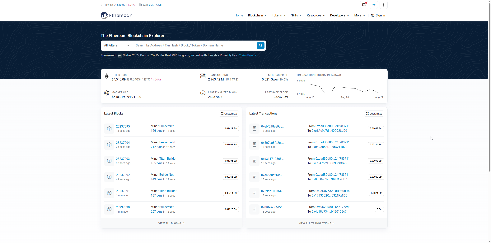
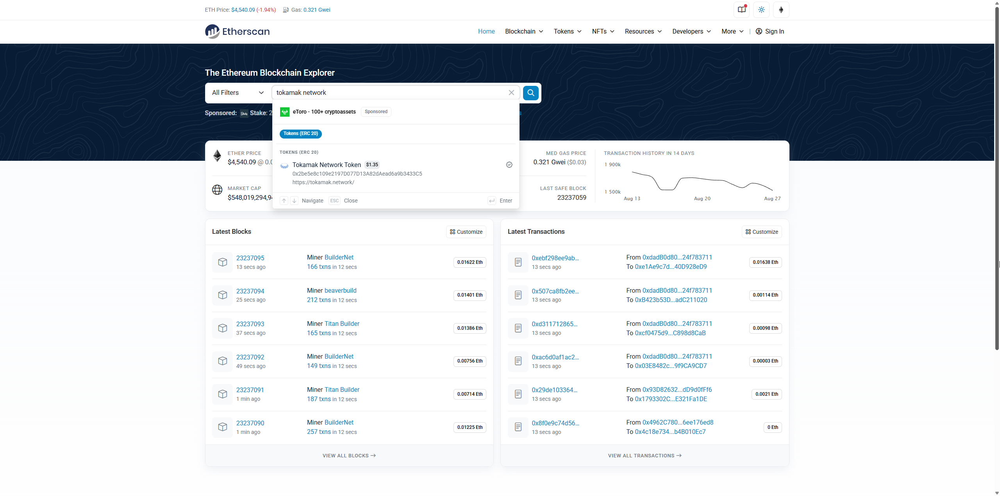
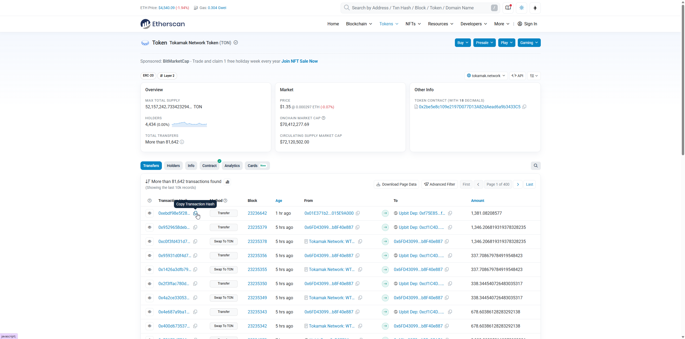

# Tokamak-zk-evm-playground User Guide

Hello! This document guides you on how to install and run **Tokamak-zk-evm-playground** on your computer. It might seem a bit unfamiliar, but if you follow the steps carefully, it won't be difficult! 😊

## 1. What is this program?

- Tokamak-zk-evm-playground is a program that helps you understand and experience the overall flow of Tokamak zk-EVM easily and enjoyably without requiring difficult technical knowledge.
- It's like looking inside and tinkering with a complex machine, allowing you to simulate the key processes of Tokamak zk-EVM step by step.

## 2. Before you start: Optionally install "CUDA" for better performance! ⚡

- **What about CUDA? (Optional but Recommended for NVIDIA GPU users) ⚡**
  - **What is CUDA?**
    - CUDA is NVIDIA's technology that allows the GPU (graphics card) to help with computational work, making processes much faster.
  - **Why is it helpful?**
    - If you have an NVIDIA GPU and CUDA installed, Tokamak-zk-EVM can use GPU acceleration to run significantly faster, especially during the setup and proving phases.
    - Don't worry if you don't have NVIDIA GPU or CUDA - the program works perfectly fine with just CPU processing, it will just take a bit longer.
  - **Do I need it?**
    - **Optional but recommended:** CUDA (only if you have an NVIDIA GPU and want faster performance)

## 3. Installation Process (Step-by-Step Guide) 🛠️

### 3.1. Installing CUDA (Optional but Very Recommended - for NVIDIA GPU users) ⚡

**Note:** This step is completely optional. Skip this section if you don't have an NVIDIA GPU or prefer to use CPU-only processing.

- **Check if you have an NVIDIA GPU:**
  - **Windows:** Right-click on desktop → "Display settings" → "Advanced display settings" → Check if NVIDIA GPU is listed
  - **Alternative:** Open Device Manager → "Display adapters" → Look for NVIDIA graphics card
- **CUDA Installation:**

  1. **Download CUDA Toolkit:**
     - Visit [NVIDIA CUDA Downloads](https://developer.nvidia.com/cuda-downloads)
     - Select your operating system (Windows -> x86_64 -> version 11 -> exe local)
     - Download the CUDA Toolkit installer (recommended: latest stable version)
  2. **Install CUDA:**
     - Run the downloaded installer (`cuda_X.X.X_windows.exe`)
     - Follow the installation wizard (keep default settings)
     - The installer will automatically install necessary drivers if needed
  3. **Verify CUDA Installation:**
     - Open Command Prompt (cmd) or PowerShell
     - Type: `nvcc --version`
     - If CUDA is installed correctly, you'll see version information
     - You may need to restart your computer after installation

- **Benefits of CUDA:**

  - ⚡ **Faster Processing:** GPU-accelerated computations can be 5-10x faster than CPU-only
  - 🚀 **Better Experience:** Shorter waiting times during backend phases
  - 🔧 **Automatic Detection:** The playground automatically detects and uses CUDA if available

- **What if CUDA installation fails?**
  - Don't worry! The playground works perfectly without CUDA
  - You can always install CUDA later if you want to try GPU acceleration
  - Make sure your NVIDIA drivers are up to date before installing CUDA

### 3.2. Downloading and Preparing Tokamak-zk-evm-playground

- **Download:**
  - [Download the latest version](https://github.com/tokamak-network/Tokamak-zk-EVM-playgrounds/releases/tag/0.0.1-alpha)
  - From the download page, download only one file that matches your operating system and CPU.
  - **Windows users:** Download the `playground-hub-windows-x64-vX.X.X-portable.zip` file. (`X.X.X` is the version)
  - **Mac users (Apple Silicon):** Download the `playground-hub-macOS-arm64-vX.X.X-portable.zip` file. (`X.X.X` is the version)
  - **Note:** You do not need to download the files marked as `Source code`, as they are for developers.
- **Extract and File Location:**

  - Extract the downloaded compressed file.
  - **Windows:** After extracting, you will get a folder containing `tokamak-zk-evm-playground.exe` file. Move this folder to a convenient location, such as `My Documents`, `Program Files`, or your Desktop.
  - **Mac:** After extracting, you will get a `tokamak-zk-evm-playground.app` file. Move this file to a convenient location, such as your Desktop or Applications folder.

## 4. Running Tokamak-zk-evm-playground 🚀

1. Run `tokamak-zk-evm-playground`.

- **Windows:** Navigate to the folder you extracted earlier and double-click the executable file, such as `tokamak-zk-evm-playground.exe`.
- **macOS:** Double-click the `tokamak-zk-evm-playground.app` file from the location where you moved it (e.g., `Applications` folder or Desktop).

2. Wait a moment for the program to start.

## 5. How to Use the Program (Brief Introduction) 📖

1. If the program runs successfully, you will see a screen like this.
   

2. Click on the area with the "Turn your Ethereum transaction..." message, and you will see a screen where you can input the transaction hash as shown below.
   

3. Finding Ethereum Transactions on Etherscan

   To use the playground, you'll need an Ethereum transaction hash. Here's how to find one using Tokamak Network token transactions as an example:

   - Go to the [Etherscan page](https://etherscan.io/).
     
   - Search for Tokamak Network token transactions or navigate to any transaction you want to verify.
     
   - Find a transaction you want to verify through the Tokamak-zk-EVM and copy its hash value using the copy button next to the Transaction Hash.
     

4. Paste the copied transaction hash into the app's input field. When a valid transaction is entered, the Process button will turn blue and become activated.
   

5. Click the Process button to start the Tokamak-zk-EVM operation. Based on average computer specifications, it takes a few minutes to complete, and you can watch the planet gradually form as the process progresses.
   

6. When the process is complete, you will see log messages from the Tokamak-zk-EVM analysis of the transaction, along with download buttons to access materials such as Proof data.
   

**🎉 Congratulations! You have completed one full cycle of the Tokamak-zk-EVM-playground.**

**Analyzing Additional Transactions:**

- If you want to analyze other transactions, simply repeat steps 2-6 above.
- Enter a new transaction hash and click the Process button to proceed with the analysis in the same way.
- Each transaction will provide unique analysis results and Proof data.

## 6. Having Trouble? (Simple Troubleshooting) 🤔

- **Performance is slower than expected:**

  - **With NVIDIA GPU:** Make sure CUDA is properly installed and GPU acceleration is working
  - **Without NVIDIA GPU:** This is normal - CPU processing takes longer but works perfectly fine
  - Close other resource-intensive applications during proving/setup phases

- **If you need more help, leave an issue on the [GitHub Issues page](https://github.com/tokamak-network/Tokamak-zk-EVM-playgrounds/issues):**

## 7. Uninstalling the Program 🗑️

- **Uninstalling Tokamak-zk-evm-playground:**
  - Exit the `Tokamak-zk-evm-playground` program.
  - Delete the entire folder where the program is installed (or extracted) or just the executable file. (No separate uninstaller is needed!)
- **Uninstalling CUDA (optional - if you no longer need GPU acceleration):**
  - **Windows:** Go to `Settings` > `Apps` > `Installed Apps` list, find entries starting with "NVIDIA CUDA" and remove them.
  - **Alternative:** Use the NVIDIA Control Panel to uninstall CUDA components.
  - (Be cautious when removing CUDA, as other GPU-accelerated applications may need it!)
  - (You can always reinstall CUDA later if needed for other applications or future use.)
