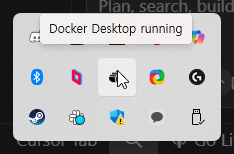
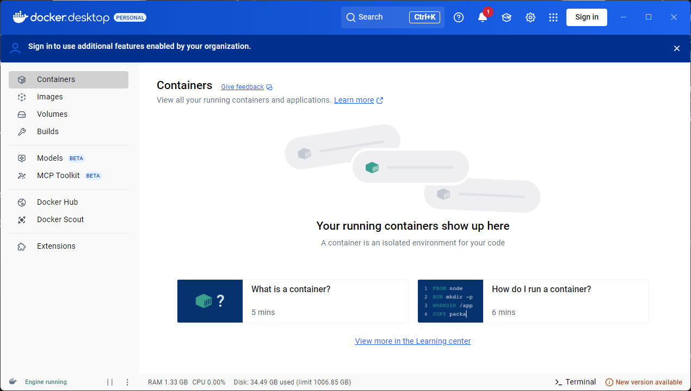
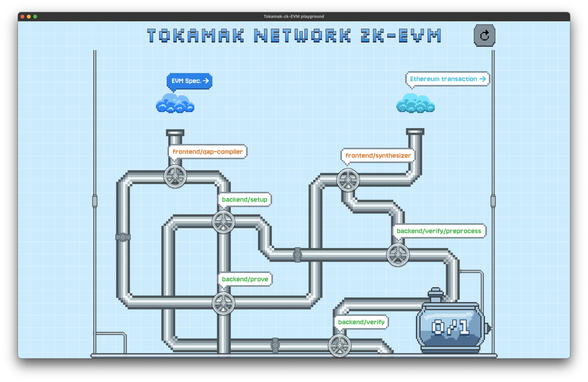
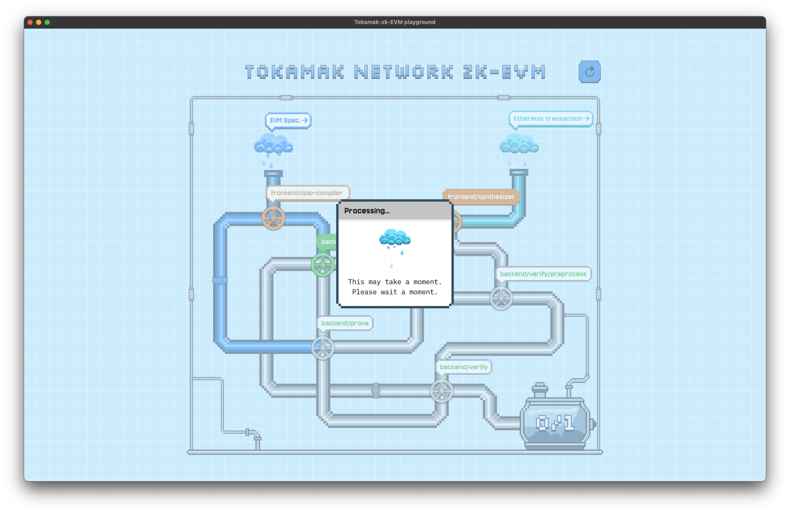

# Tokamak-zk-evm-playground User Guide

Hello! This document guides you on how to install and run **Tokamak-zk-evm-playground** on your computer. It might seem a bit unfamiliar, but if you follow the steps carefully, it won't be difficult! 😊

## 1. What is this program?

- Tokamak-zk-evm-playground is a program that helps you understand and experience the overall flow of Tokamak zk-EVM easily and enjoyably without requiring difficult technical knowledge.
- It's like looking inside and tinkering with a complex machine, allowing you to simulate the key processes of Tokamak zk-EVM step by step.

## 2. Before you start: You need "Docker" and optionally "CUDA"! 🐳⚡

- **What is Docker?**
  - Docker is like a magic box that helps our program (Tokamak-zk-EVM) run smoothly on any computer without complex settings. Thanks to this box, you can have all the necessary preparations at once, greatly reducing the "It doesn't work on my computer" problem.
- **Why is it needed?**

  - Tokamak-zk-EVM requires various development tools and a special execution environment. Docker neatly packages all of this, allowing you to focus on using the program instead of going through a complex installation process.

- **What about CUDA? (Optional but Recommended for NVIDIA GPU users) ⚡**
  - **What is CUDA?**
    - CUDA is NVIDIA's technology that allows the GPU (graphics card) to help with computational work, making processes much faster.
  - **Why is it helpful?**
    - If you have an NVIDIA GPU and CUDA installed, Tokamak-zk-EVM can use GPU acceleration to run significantly faster, especially during the setup and proving phases.
    - Don't worry if you don't have NVIDIA GPU or CUDA - the program works perfectly fine with just CPU processing, it will just take a bit longer.
  - **Do I need it?**
    - **Required:** Docker (essential for all users)
    - **Optional but recommended:** CUDA (only if you have an NVIDIA GPU and want faster performance)

## 3. Installation Process (Step-by-Step Guide) 🛠️

### 3.1. Installing Docker

- **Requirements:**
  - A stable internet connection
  - Check the operating system of your computer (e.g., Windows 10/11, latest macOS version, etc.)
- **Installation Method:**

  1.  **Access the Docker download page:**
      - **Windows users:** [Download Docker Desktop for Windows](https://www.docker.com/products/docker-desktop/) (Click to go to the download page)
      - **Mac users (Check Apple Silicon chip before downloading):** [Download Docker Desktop for Mac](https://www.docker.com/products/docker-desktop/) (Click to go to the download page)
  2.  **Proceed with download and installation:**
      - Run the downloaded installation file (`Docker Desktop Installer.exe` or `Docker.dmg`) and follow the on-screen instructions to complete the installation.
      - (For Windows, you may need to install or configure WSL 2. Follow the on-screen instructions carefully.)
      - (There are no special options to select; keeping the default settings is fine.)
  3.  **Verify installation (Most important! ✨):**

      - Launch **Docker Desktop** from the desktop or application list.
      - Check if the **whale icon** 🐳 appears in the taskbar (Windows) or the menu bar at the top of the screen (Mac).

        **Windows:**
        

        **MacOS:**

      - You can check the running status from the menu that appears when you click the whale icon. Look for a message like "Docker Desktop is running" or a green "Running" indicator.

        **Windows:**
        
        

        **MacOS:**
        
        

        - If Docker doesn't run correctly or you see an error, try restarting your computer. A reboot is sometimes required after installation.

### 3.1.1. Installing CUDA (Optional but Very Recommended - for NVIDIA GPU users) ⚡

**Note:** This step is completely optional. Skip this section if you don't have an NVIDIA GPU or prefer to use CPU-only processing.

- **Check if you have an NVIDIA GPU:**
  - **Windows:** Right-click on desktop → "Display settings" → "Advanced display settings" → Check if NVIDIA GPU is listed
  - **Alternative:** Open Device Manager → "Display adapters" → Look for NVIDIA graphics card
- **CUDA Installation:**

  1. **Download CUDA Toolkit:**
     - Visit [NVIDIA CUDA Downloads](https://developer.nvidia.com/cuda-downloads)
     - Select your operating system (Windows -> x86_64 -> version 11 -> exe local)
     - Download the CUDA Toolkit installer (recommended: latest stable version)
  2. **Install CUDA:**
     - Run the downloaded installer (`cuda_X.X.X_windows.exe`)
     - Follow the installation wizard (keep default settings)
     - The installer will automatically install necessary drivers if needed
  3. **Verify CUDA Installation:**
     - Open Command Prompt (cmd) or PowerShell
     - Type: `nvcc --version`
     - If CUDA is installed correctly, you'll see version information
     - You may need to restart your computer after installation

- **Benefits of CUDA:**

  - ⚡ **Faster Processing:** GPU-accelerated computations can be 5-10x faster than CPU-only
  - 🚀 **Better Experience:** Shorter waiting times during backend phases
  - 🔧 **Automatic Detection:** The playground automatically detects and uses CUDA if available

- **What if CUDA installation fails?**
  - Don't worry! The playground works perfectly without CUDA
  - You can always install CUDA later if you want to try GPU acceleration
  - Make sure your NVIDIA drivers are up to date before installing CUDA

### 3.2. Downloading and Preparing Tokamak-zk-evm-playground

- **Download:**
  - [Download the latest version](https://github.com/tokamak-network/Tokamak-zk-EVM-playgrounds/releases)
  - From the download page, download only one file that matches your operating system and CPU.
  - **Windows users:** Download the `tokamak-zk-evm-playground-hub-win32-x64.zip` file.
  - **Mac users (Apple Silicon):** Download the `tokamak-zk-evm-playground-hub-darwin-arm64.zip` file.
  - **Note:** You do not need to download the files marked as `Source code`, as they are for developers.
- **Extract and File Location:**

  - Extract the downloaded compressed file.
  - **Windows:** After extracting, you will get a folder containing `tokamak-zk-evm-playground.exe` file. Move this folder to a convenient location, such as `My Documents`, `Program Files`, or your Desktop.
  - **Mac:** After extracting, you will get a `tokamak-zk-evm-playground.app` file. Move this file to a convenient location, such as your Desktop.

    **Note:** If you encounter a "damaged" or "unidentified developer" error when trying to open the app, follow these steps:

    1. **Open Terminal:**
       - Press `Cmd + Space` to open Spotlight Search
       - Type "Terminal" and press Enter
       - A black window with white text will open (this is Terminal)
    2. **Copy the command below and paste it in Terminal:**

       ```bash
       xattr -d com.apple.quarantine ~/Desktop/tokamak-zk-evm-playground-hub.app
       ```

       **If you placed the app in a different location:** Replace `~/Desktop/` with the actual path where you moved the app. For example:

       - If you put it in Documents: `~/Documents/tokamak-zk-evm-playground-hub.app`
       - If you put it in Downloads: `~/Downloads/tokamak-zk-evm-playground-hub.app`
       - If you put it in a custom folder: `/path/to/your/folder/tokamak-zk-evm-playground-hub.app`

    3. **Press Enter** to run the command
    4. **Try opening the app again** - it should now work without the error

    **What this does:** This command tells macOS that the app is safe to run, removing the security restriction that was preventing it from opening.

## 4. Running Tokamak-zk-evm-playground 🚀

1. **(Most important!) First, make sure Docker Desktop is running.** (The whale icon 🐳 should be visible and in "running" status in the taskbar for Windows or the menu bar for Mac!)

- If Docker is not installed or running, a warning message will appear, and you cannot proceed to the next step.

2.  Run `tokamak-zk-evm-playground`.

- **Windows:** Navigate to the folder you extracted earlier and double-click the executable file, such as `tokamak-zk-evm-playground.exe`.
- **macOS:** Double-click the `tokamak-zk-evm-playground.app` file from the location where you moved it (e.g., `Applications` folder or Desktop).

3. Wait a moment for the program to start.

## 5. How to Use the Program (Brief Introduction) 📖

1. If the program runs successfully, you will see a screen like this.
   

   **Note:** The application is designed for a resolution of 1000x1000 pixels. If you experience UI layout issues or elements appearing broken on lower resolution displays like this:
   

   You can fix this by zooming out:

   - **Windows:** Press `Ctrl + -` (Control + minus)
   - **Mac:** Press `Cmd + -` (Command + minus)

   This will scale down the interface to fit better on your screen without breaking the layout.

2. Click the cloud located under the **EVM Spec.** heading in the top left corner to display a modal screen like this.  
   
3. This modal allows you to select one of the various Tokamak-zk-EVM specs supported by the playground. Click the download button to the right of the title to start downloading the Docker image for that spec.
   
4. Once the download is complete, the download button icon will change to a check icon, indicating that the image is ready. Clicking the Tokamak-zk-EVM text in this state will proceed to the next step.  
   
5. After clicking, the modal will automatically close, and an animation filling the pipeline will start. The animation will stop when it reaches the handle for the next step, and the previously inactive **frontend/qap-compiler** heading will become colored, indicating it is ready for execution.
   
6. Once you click on the activated **frontend/qap-compiler** handle and the process has finished, you will see that **backend/setup** is activated. Next, let's run Ethereum transaction.
   
7. Let's set up the EVM Transaction in the same flow. Similar to the EVM Spec, click the cloud under the **Ethereum transaction** heading to open a modal. In this modal's input area, you need to enter the hash of an Ethereum transaction that matches the characteristics supported by the previously selected EVM Spec. Go to the [Etherscan page](https://etherscan.io/).
   
8. Find a transaction you want to verify through the Tokamak-zk-EVM and copy its hash value using the copy button next to the Transaction Hash.
   
9. Paste the copied hash value into the modal's input area. If the transaction hash is provable by the current Tokamak-zk-EVM, the Input button will be activated as follows.
   

10. When the Input button is activated, click it to close the modal, and an animation similar to the previous one will start. Once the animation is complete, you will see that the handles for both backend/setup and frontend/synthesizer are activated. You can execute the activated handles in any order. In this guide, we will execute synthesizer first.
    
11. After frontend/synthesizer finishes, you can infer from the pipelines that **backend/setup** must also be completed. Let's proceed with the only activated part, backend/setup.
    
    

12. Once backend/setup is complete, **backend/prove** is activated. The actual setup process takes a considerable amount of time, but it is already complete within the Docker image you downloaded earlier. Therefore, it runs very quickly inside the playground.
    
13. Once backend/setup is complete, both packages required for the final action, Verify, are ready for execution. First, run backend/preprocess.
    
    
14. Next, run backend/prove, and you will see **backend/verify** become activated. By running verify, you can see the final result of how the Ethereum transaction you selected is analyzed by the Tokamak-zk-EVM.
    
    

    **Pro tip:** The prove process is the marathon of our playground! 🏃‍♂️ It's the longest step in the entire pipeline, so grab a coffee ☕ and watch the processing modal change through different stages - it's like watching a progress bar that actually tells you what's happening behind the scenes. Each modal change means we're one step closer to that sweet verification result!

15. After backend/prove completes, the water tank will change based on the generated proof and its verification result. If the proof was generated correctly and verified successfully, the tank will fill with blue water along with the number **1**, signifying "True". This indicates that the Tokamk-zk-EVM has operated correctly.
    
    15-1. If it did not operate correctly or an issue occurred, the tank will fill with white water along with the number 0, signifying "False". In this case, there may be an issue with the Tokamak-zk-EVM, so please report it using Section 6 below!
    

## 6. Having Trouble? (Simple Troubleshooting) 🤔

- **"Docker is not running" message appears / The program cannot find Docker.**

  - First, make sure Docker Desktop is really running (whale icon 🐳!).
  - Try completely closing Docker Desktop and running it again.
  - Reboot your computer, run Docker Desktop first, and then run Tokamak-zk-evm-playground.

- **Performance is slower than expected:**

  - **With NVIDIA GPU:** Make sure CUDA is properly installed and GPU acceleration is working
  - **Without NVIDIA GPU:** This is normal - CPU processing takes longer but works perfectly fine
  - Close other resource-intensive applications during proving/setup phases

- **If you need more help, leave an issue on the [GitHub Issues page](https://github.com/tokamak-network/Tokamak-zk-EVM-playgrounds/issues):**

## 7. Uninstalling the Program 🗑️

- **Uninstalling Tokamak-zk-evm-playground:**
  - Exit the `Tokamak-zk-evm-playground` program.
  - Delete the entire folder where the program is installed (or extracted) or just the executable file. (No separate uninstaller is needed!)
- **Uninstalling Docker (if you no longer use Tokamak-zk-evm-playground or other Docker-based programs):**
  - **Windows:** Go to `Settings` > `Apps` > `Installed Apps` list, find `Docker Desktop`, and remove it.
  - **Mac:** Drag `Docker.app` from the `Applications` folder to the trash.
  - (Be cautious when deleting Docker, as you won't be able to use other Docker-based programs!)
  - (For more details, refer to the uninstallation guide on the official Docker website.)
- **Uninstalling CUDA (optional - if you no longer need GPU acceleration):**
  - **Windows:** Go to `Settings` > `Apps` > `Installed Apps` list, find entries starting with "NVIDIA CUDA" and remove them.
  - **Alternative:** Use the NVIDIA Control Panel to uninstall CUDA components.
  - (Be cautious when removing CUDA, as other GPU-accelerated applications may need it!)
  - (You can always reinstall CUDA later if needed for other applications or future use.)
