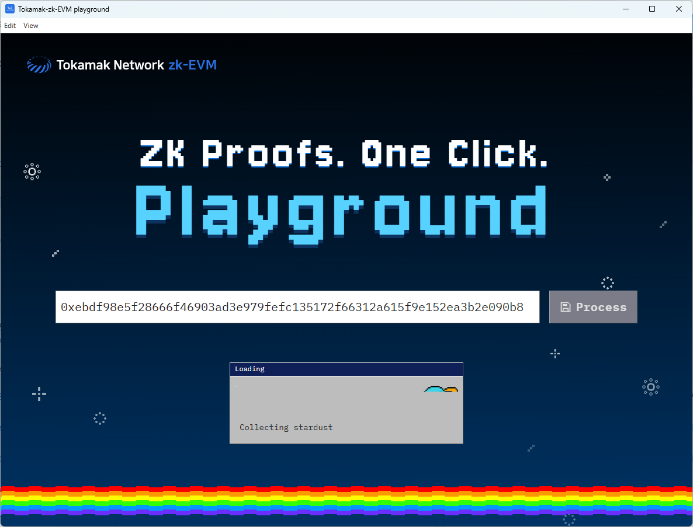

# Tokamak-zk-evm-playground User Guide

Hello! This document guides you on how to install and run **Tokamak-zk-evm-playground** on your computer. It might seem a bit unfamiliar, but if you follow the steps carefully, it won't be difficult! 😊

## 1. What is this program?

- Tokamak-zk-evm-playground is a program that helps you understand and experience the overall flow of Tokamak zk-EVM easily and enjoyably without requiring difficult technical knowledge.
- It's like looking inside and tinkering with a complex machine, allowing you to simulate the key processes of Tokamak zk-EVM step by step.

## 2. Before you start: Optional enhancements! ⚡

- **For NVIDIA GPU users:** Want faster performance? See our [CUDA Setup Guide](./CUDA_SETUP.md) to enable GPU acceleration (completely optional!)
- **For Developers:** Want to use the CLI interface? Visit the main [Tokamak-zk-EVM repository](https://github.com/tokamak-network/Tokamak-zk-EVM) to experience the full development environment

## 3. Installation Process (Step-by-Step Guide) 🛠️

### Downloading and Preparing Tokamak-zk-evm-playground

- **Download:**
  - [Download the latest version](https://github.com/tokamak-network/Tokamak-zk-EVM-playgrounds/releases/tag/0.0.1-alpha)
  - From the download page, download only one file that matches your operating system and CPU.
  - **Windows users:** Download the `playground-hub-windows-x64-vX.X.X-portable.zip` file. (`X.X.X` is the version)
  - **Mac users (Apple Silicon):** Download the `playground-hub-macOS-arm64-vX.X.X-portable.zip` file. (`X.X.X` is the version)
  - **Note:** You do not need to download the files marked as `Source code`, as they are for developers.
- **Extract and File Location:**

  - Extract the downloaded compressed file.
  - **Windows:** After extracting, you will get a folder containing `tokamak-zk-evm-playground.exe` file. Move this folder to a convenient location, such as `My Documents`, `Program Files`, or your Desktop.
  - **Mac:** After extracting, you will get a `tokamak-zk-evm-playground.app` file. Move this file to a convenient location, such as your Desktop or Applications folder.

## 4. Running Tokamak-zk-evm-playground 🚀

1. Run `tokamak-zk-evm-playground`.

- **Windows:** Navigate to the folder you extracted earlier and double-click the executable file, such as `tokamak-zk-evm-playground.exe`.
- **macOS:** Double-click the `tokamak-zk-evm-playground.app` file from the location where you moved it (e.g., `Applications` folder or Desktop).

2. Wait a moment for the program to start.

## 5. How to Use the Program (Brief Introduction) 📖

1. If the program runs successfully, you will see a screen like this.
   

2. Click on the area with the "Turn your Ethereum transaction..." message, and you will see a screen where you can input the transaction hash as shown below.
   

3. Finding Ethereum Transactions on Etherscan

   To use the playground, you'll need an Ethereum transaction hash. Here's how to find one using Tokamak Network token transactions as an example:

   - Go to the [Etherscan page](https://etherscan.io/).
     
   - Search for Tokamak Network token transactions or navigate to any transaction you want to verify.
     
   - Find a transaction you want to verify through the Tokamak-zk-EVM and copy its hash value using the copy button next to the Transaction Hash.
     

4. Paste the copied transaction hash into the app's input field. When a valid transaction is entered, the Process button will turn blue and become activated.
   

5. Click the Process button to start the Tokamak-zk-EVM operation. Based on average computer specifications, it takes a few minutes to complete, and you can watch the planet gradually form as the process progresses.
   

6. When the process is complete, you will see log messages from the Tokamak-zk-EVM analysis of the transaction, along with download buttons to access materials such as Proof data.
   

**🎉 Congratulations! You have completed one full cycle of the Tokamak-zk-EVM-playground.**

**Analyzing Additional Transactions:**

- If you want to analyze other transactions, simply repeat steps 2-6 above.
- Enter a new transaction hash and click the Process button to proceed with the analysis in the same way.
- Each transaction will provide unique analysis results and Proof data.

## 6. Having Trouble? (Simple Troubleshooting) 🤔

- **Performance is slower than expected:**

  - This is normal - the playground works perfectly fine, typically completing within 5 minutes on average computer specifications, or at most 10 minutes
  - For faster performance, consider installing CUDA if you have an NVIDIA GPU (see [CUDA Setup Guide](./CUDA_SETUP.md))
  - Close other resource-intensive applications during processing

- **If you need more help, leave an issue on the [GitHub Issues page](https://github.com/tokamak-network/Tokamak-zk-EVM-playgrounds/issues):**

## 7. Uninstalling the Program 🗑️

- **Uninstalling Tokamak-zk-evm-playground:**
  - Exit the `Tokamak-zk-evm-playground` program.
  - Delete the entire folder where the program is installed (or extracted) or just the executable file. (No separate uninstaller is needed!)
- **Uninstalling CUDA (if installed):**
  - See the [CUDA Setup Guide](./CUDA_SETUP.md) for detailed uninstallation instructions.
