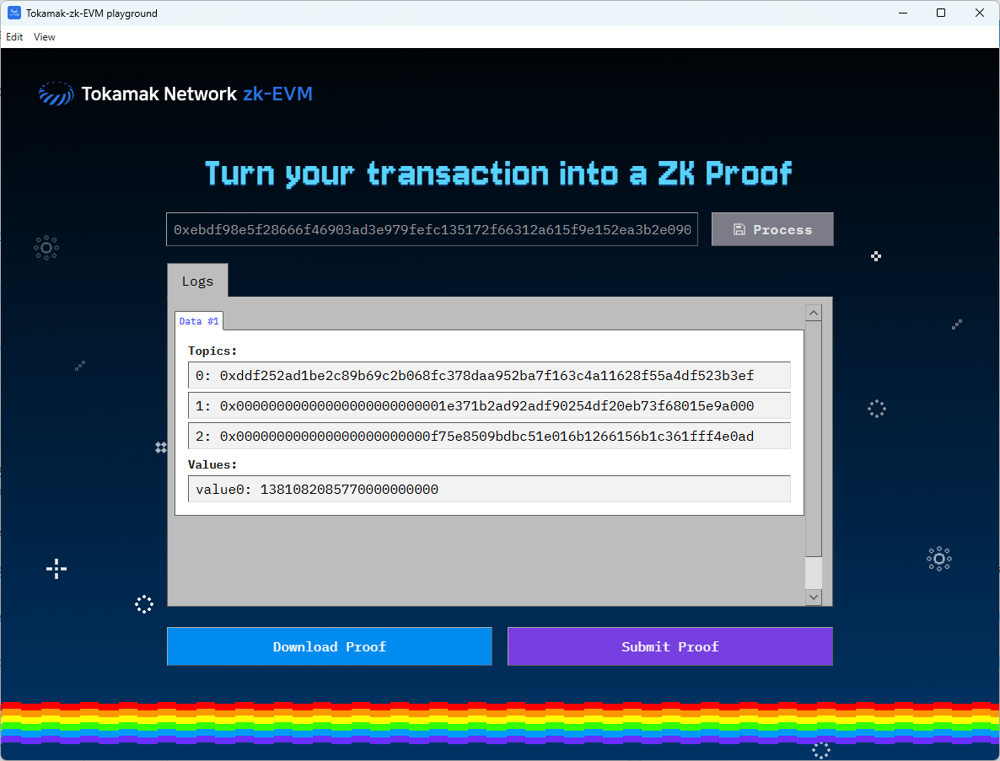

# Tokamak-zk-evm-playground User Guide

Hello! This document guides you on how to install and run **Tokamak-zk-evm-playground** on your computer. It might seem a bit unfamiliar, but if you follow the steps carefully, it won't be difficult! 😊

## 1. What is this program?

- Tokamak-zk-evm-playground is a program that helps you understand and experience the overall flow of Tokamak zk-EVM easily and enjoyably without requiring difficult technical knowledge.
- It's like looking inside and tinkering with a complex machine, allowing you to simulate the key processes of Tokamak zk-EVM step by step.

## 2. Before you start: You need "Docker"! 🐳

- **What is Docker?**
  - Docker is like a magic box that helps our program (Tokamak-zk-EVM) run smoothly on any computer without complex settings. Thanks to this box, you can have all the necessary preparations at once, greatly reducing the "It doesn't work on my computer" problem.
- **Why is it needed?**
  - Tokamak-zk-EVM requires various development tools and a special execution environment. Docker neatly packages all of this, allowing you to focus on using the program instead of going through a complex installation process.

## 3. Installation Process (Step-by-Step Guide) 🛠️

### 3.1. Installing Docker

- **Requirements:**
  - A stable internet connection
  - Check the operating system of your computer (e.g., Windows 10/11, latest macOS version, etc.)
- **Installation Method:**

  1. **Access the Docker download page:**
     - **Windows users:** [Download Docker Desktop for Windows](https://www.docker.com/products/docker-desktop/) (Click to go to the download page)
     - **Mac users (Check Intel chip / Apple Silicon chip before downloading):** [Download Docker Desktop for Mac](https://www.docker.com/products/docker-desktop/) (Click to go to the download page)
  2. **Proceed with download and installation:**
     - Run the downloaded installation file (`Docker Desktop Installer.exe` or `Docker.dmg`) and follow the on-screen instructions to complete the installation.
     - (For Windows, you may need to install or configure WSL 2. Follow the on-screen instructions carefully.)
     - (If there are any special options to select, specify them here. Most of the time, keeping the default settings is fine.)
  3. **Verify installation (Most important! ✨):**

     - You may need to reboot your computer after installation.
     - Launch **Docker Desktop** from the desktop or application list.
     - Check if the **whale icon** 🐳 appears in the taskbar (Windows) or dock menu (Mac).
       
     - If you see the message "Docker Desktop is running" (or a green "Running" indicator) when you click the whale icon, or if the Docker program window opens, it means it has been successfully executed!

       

       

       - If it doesn't run or you see an error message, try rebooting your computer and running Docker Desktop again.

### 3.2. Downloading and Preparing Tokamak-zk-evm-playground

- **Download:**
  - [Download the latest version](https://github.com/tokamak-network/Tokamak-zk-EVM-playgrounds/releases/tag/0.0.1-alpha)
  - The download file is in a compressed `.zip` format.
  - **Mac users (Apple Silicon):** Download the arm-64 version. (e.g., `playground-hub-macOS-arm64-v0.0.1-portable.zip`)
  - **Windows users:** Download the Windows version.
- **Extract:**
  - Extract the downloaded compressed file to a convenient folder. (e.g., Right-click and "Extract..." on Windows, double-click on Mac)
- **File Location:**
  - Place the extracted `Tokamak-zk-evm-playground` folder in an easily accessible location. (e.g., `Desktop`, `Documents`, or `Downloads` folder)

## 4. Running Tokamak-zk-evm-playground 🚀

1. **(Most important!) First, make sure Docker Desktop is running.** (The whale icon 🐳 should be visible and in "running" status!)

- If Docker is not installed or running, a warning message will appear, and you cannot proceed to the next step.

2. Navigate to the folder where you previously extracted `Tokamak-zk-evm-playground`.
3. Find and double-click the following executable file inside the folder:
   - **Windows:** `(Executable file name.exe)` (e.g., `tokamak-zk-evm-playground.exe`)
   - **macOS:** `(Executable file name.app)` (e.g., `tokamak-zk-evm-playground.app`)
4. Wait a moment for the program to start.

## 5. How to Use the Program (Brief Introduction) 📖

1. If the program runs successfully, you will see a screen like this.
   
2. Click the cloud located under the **EVM Spec.** heading in the top left corner to display a modal screen like this.  
   
3. This modal allows you to select one of the various Tokamak-zk-EVM specs supported by the playground. Click the download button to the right of the title to start downloading the Docker image for that spec.
   
4. Once the download is complete, the download button icon will change to a check icon, indicating that the image is ready. Clicking the Tokamak-zk-EVM text in this state will proceed to the next step.  
   
5. After clicking, the modal will automatically close, and an animation filling the pipeline will start. The animation will stop when it reaches the handle for the next step, and the previously inactive **frontend/qap-compiler** heading will become colored, indicating it is ready for execution.
   
6. Let's set up the EVM Transaction in the same flow. Similar to the EVM Spec, click the cloud under the **Ethereum transaction** heading to open a modal. In this modal's input area, you need to enter the hash of an Ethereum transaction that matches the characteristics supported by the previously selected EVM Spec. Go to the [Etherscan page](https://etherscan.io/).
   
7. Find a transaction you want to verify through the Tokamak-zk-EVM and copy its hash value using the copy button next to the Transaction Hash.
   
8. Paste the copied hash value into the modal's input area. If the transaction hash is provable by the current Tokamak-zk-EVM, the Input button will be activated as follows.
   
   8-1. If the copied hash value is incorrect, an error like this will appear, and the Input button will not be activated. For any other issues, the button will also remain inactive, and a message corresponding to the problem will be displayed in the same area.  
   
9. When the Input button is activated, click it to close the modal, and an animation similar to the previous one will start. Once the animation is complete, you will see that the handles for both frontend/qap-compiler and frontend/synthesizer are activated. You can execute the activated handles in any order. In this guide, we will execute qap-compiler first.
   
10. Once frontend/qap-compiler has finished, you will see that both **frontend/synthesizer** and **backend/setup** are activated. Next, let's run frontend/synthesizer. (For processes that take some time to execute, a loading modal like the one below will appear. When the process is complete, the modal will automatically close, and the animation will continue.)
    
    
11. After frontend/synthesizer finishes, you can infer from the pipelines that **backend/setup** must also be completed. Let's proceed with the only activated part, backend/setup.
    
12. Once backend/setup is complete, **backend/prove** is activated. The actual setup process takes a considerable amount of time, but it is already complete within the Docker image you downloaded earlier. Therefore, it runs very quickly inside the playground.
    
13. Once backend/setup is complete, both packages required for the final action, Verify, are ready for execution. First, run backend/preprocess.
    
    
14. Next, run backend/prove, and you will see **backend/verify** become activated. By running verify, you can see the final result of how the Ethereum transaction you selected is analyzed by the Tokamak-zk-EVM.
    
    
15. After backend/prove completes, the water tank will change based on the generated proof and its verification result. If the proof was generated correctly and verified successfully, the tank will fill with blue water along with the number **1**, signifying "True". This indicates that the Tokamk-zk-EVM has operated correctly.
    
    15-1. If it did not operate correctly or an issue occurred, the tank will fill with white water along with the number 0, signifying "False". In this case, there may be an issue with the Tokamak-zk-EVM, so please report it using Section 6 below!
    

## 6. Having Trouble? (Simple Troubleshooting) 🤔

- **"Docker is not running" message appears / The program cannot find Docker.**

  - First, make sure Docker Desktop is really running (whale icon 🐳!).
  - Try completely closing Docker Desktop and running it again.
  - Reboot your computer, run Docker Desktop first, and then run Tokamak-zk-evm-playground.

- **If you need more help, leave an issue on the [GitHub Issues page](https://github.com/tokamak-network/Tokamak-zk-EVM-playgrounds/issues):**

## 7. Uninstalling the Program 🗑️

- **Uninstalling Tokamak-zk-evm-playground:**
  - Exit the `Tokamak-zk-evm-playground` program.
  - Delete the entire folder where the program is installed (or extracted) or just the executable file. (No separate uninstaller is needed!)
- **Uninstalling Docker (if you no longer use Tokamak-zk-evm-playground or other Docker-based programs):**
  - **Windows:** Go to `Settings` > `Apps` > `Installed Apps` list, find `Docker Desktop`, and remove it.
  - **Mac:** Drag `Docker.app` from the `Applications` folder to the trash.
  - (Be cautious when deleting Docker, as you won't be able to use other Docker-based programs!)
  - (For more details, refer to the uninstallation guide on the official Docker website.)
