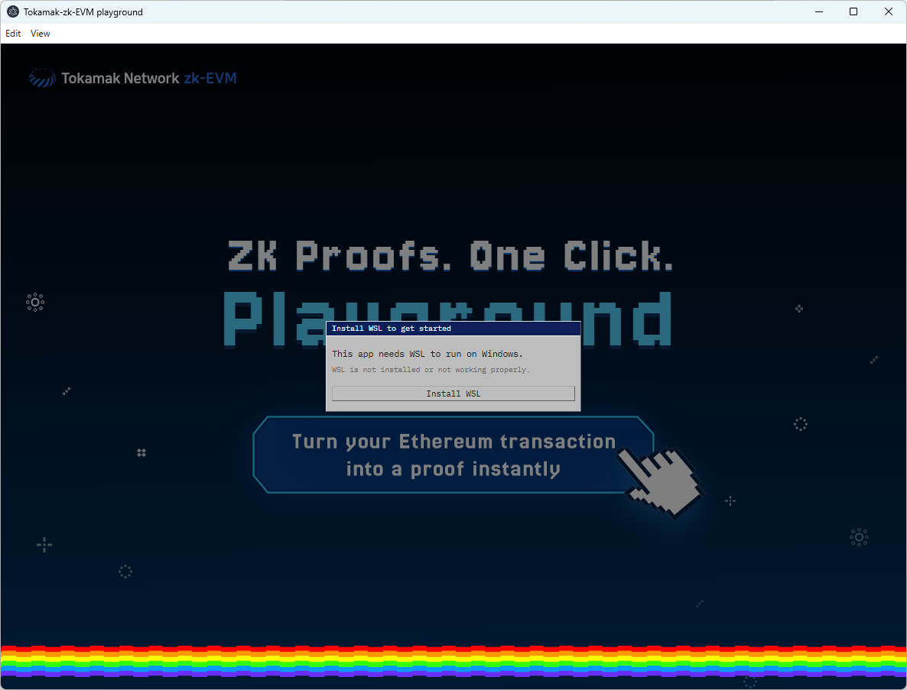
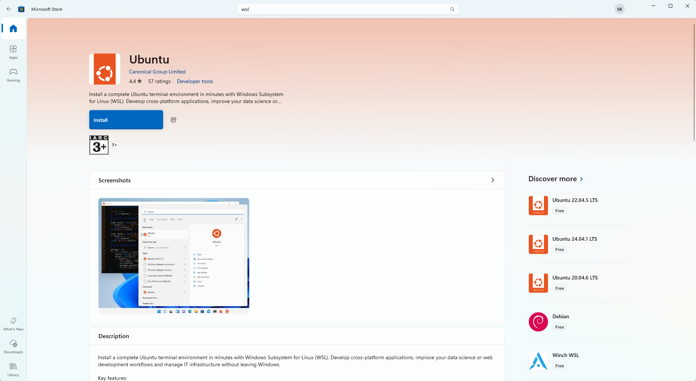
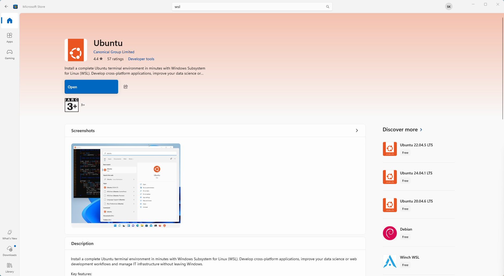
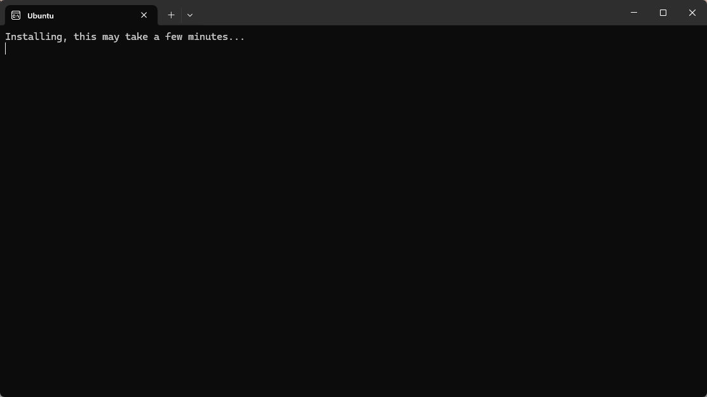
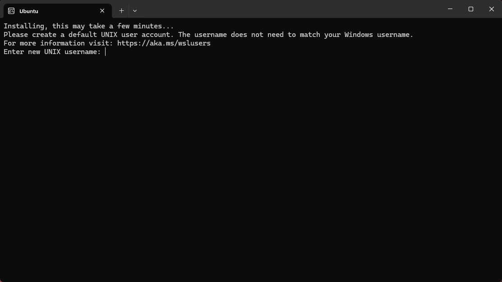
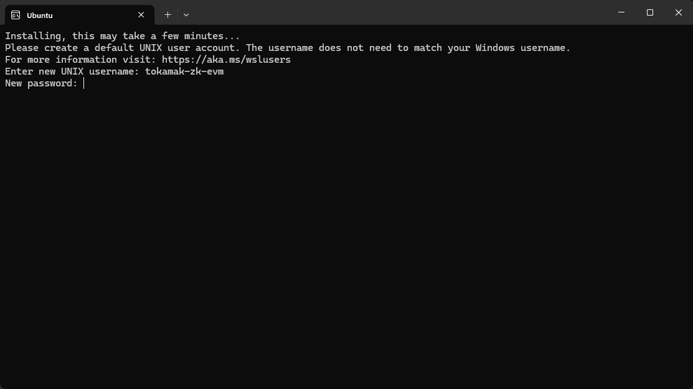
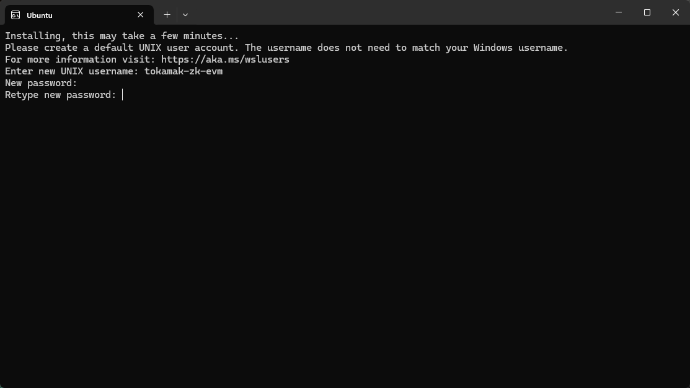
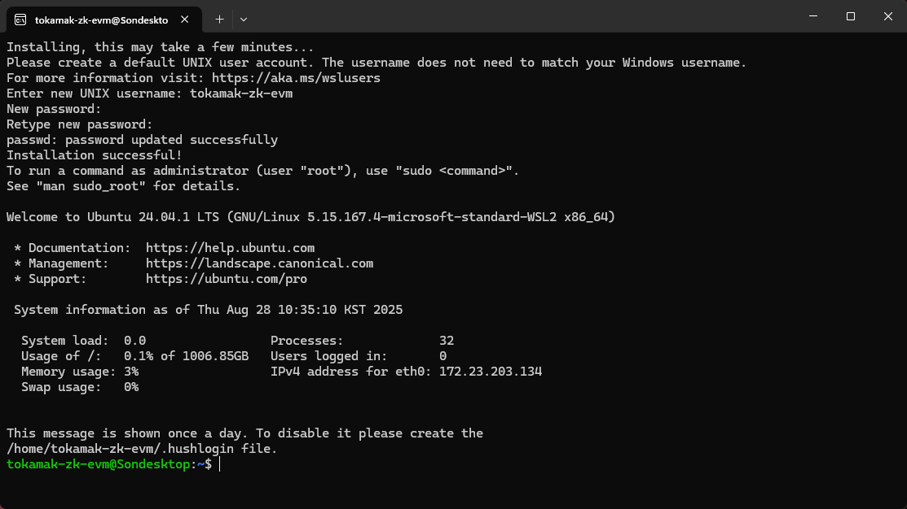

# WSL Setup Guide for Windows Users

This guide helps Windows users install WSL (Windows Subsystem for Linux) to run the Tokamak-zk-EVM-playground properly.

## What is WSL?

WSL (Windows Subsystem for Linux) allows you to run Linux commands and tools directly on Windows. The Tokamak-zk-EVM-playground requires WSL to execute certain operations on Windows systems.

## When do you need WSL?

If you see a modal asking about WSL installation when you first open the app on Windows, you need to install WSL to use the playground.

## Step-by-Step Installation

### 1. Click Install Button in the Modal

When you see the WSL installation modal in the app, click the **"Install"** button. This will automatically open Microsoft Store and take you to the Ubuntu installation page.



### 2. Install Ubuntu from Microsoft Store

Once the Microsoft Store opens:

- You'll see the Ubuntu installation page
- Click the **"Install"** button to start downloading Ubuntu
- Wait for the installation to complete


### 3. Open Ubuntu

After installation is complete:

- The "Install" button will change to **"Open"**
- Click the **"Open"** button to launch Ubuntu




### 4. Automatic Setup Process

When you click "Open":

- A command window will automatically open
- Ubuntu will start its initial setup process
- This may take a few minutes - please be patient



### 5. Create Username

During the setup process:

- You'll be asked to enter a username for WSL
- Type your desired username and press Enter




### 6. Create Password

After entering your username:

- You'll be asked to enter a password
- Type your desired password and press Enter
- You'll be asked to confirm the password - type it again and press Enter
- **Note:** You won't see the password characters as you type (this is normal for security)




### 7. Setup Complete

When you see the Ubuntu command prompt with your username, the setup is complete! You should see something like:



This means WSL is now properly installed and configured.

## After Installation

Once WSL is installed:

1. **Restart your computer** (while not always necessary, we recommend rebooting to ensure all configuration changes are properly applied)
2. **Restart the playground app**
3. **The WSL modal should no longer appear**
4. **You can now use the playground normally**

## Uninstalling WSL (If No Longer Needed)

If you want to remove WSL from your computer:

### Method 1: Uninstall Ubuntu from Microsoft Store

1. **Open Microsoft Store**
2. **Search for "Ubuntu"**
3. **Click on Ubuntu** in the search results
4. **Click "Uninstall"** button
5. **Confirm the uninstallation** when prompted

### Method 2: Uninstall from Windows Settings

1. **Open Windows Settings** (Windows key + I)
2. **Go to "Apps"**
3. **Search for "Ubuntu"** in the apps list
4. **Click on Ubuntu** and select **"Uninstall"**
5. **Confirm the uninstallation**

### Method 3: Complete WSL Removal (Advanced)

If you want to completely remove WSL from Windows:

1. **Open PowerShell as Administrator**

   - Right-click Start button
   - Select "Windows PowerShell (Admin)" or "Terminal (Admin)"

2. **Unregister Ubuntu:**

   ```powershell
   wsl --unregister Ubuntu
   ```

3. **Disable WSL feature:**

   ```powershell
   dism.exe /online /disable-feature /featurename:Microsoft-Windows-Subsystem-Linux /all /norestart
   ```

4. **Restart your computer** to complete the removal

**Note:** Method 3 will completely disable WSL on your system. Only use this if you're sure you won't need WSL for other applications.

## Need Help?

If you encounter issues with WSL installation or removal:

1. Check the [main README](./README.md) for general troubleshooting
2. Visit [Microsoft's official WSL documentation](https://docs.microsoft.com/en-us/windows/wsl/)
3. Report WSL-specific issues on our [GitHub Issues page](https://github.com/tokamak-network/Tokamak-zk-EVM-playgrounds/issues) with the "wsl" label
